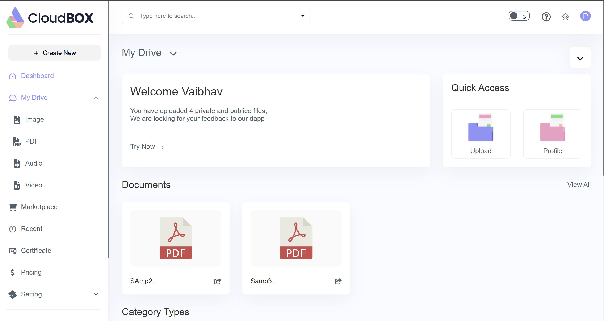
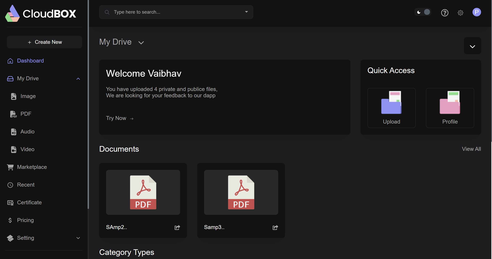
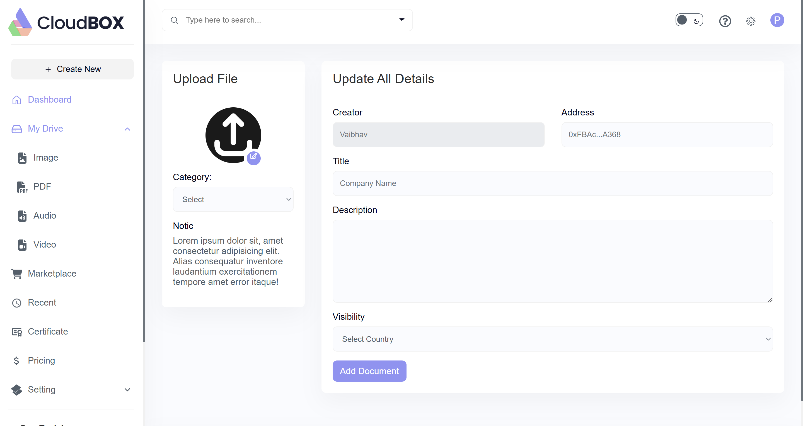
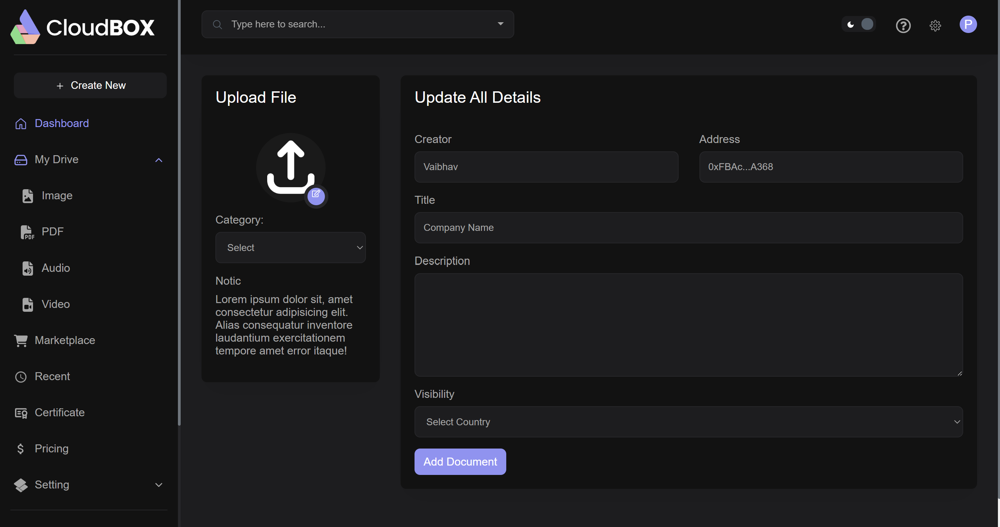
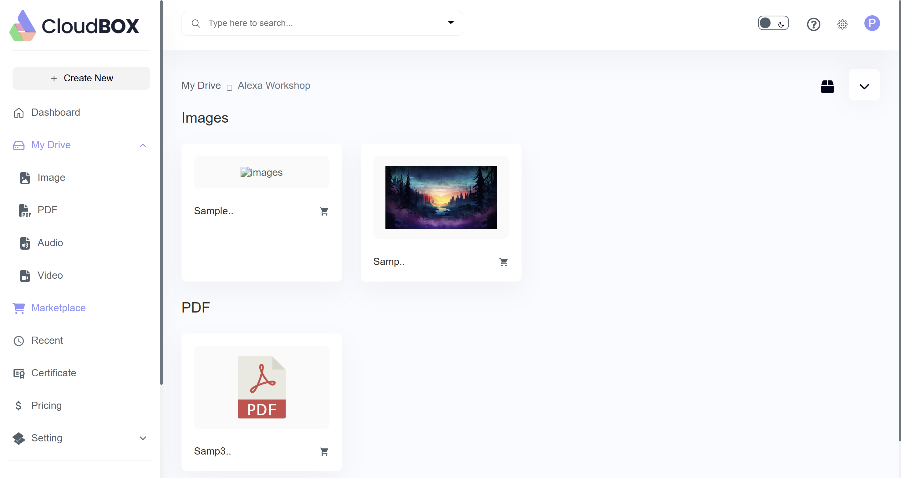
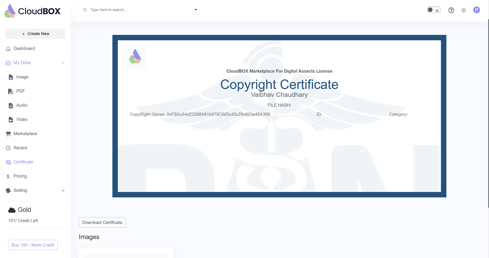
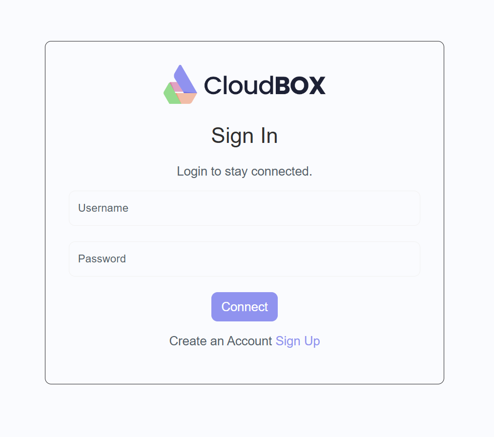
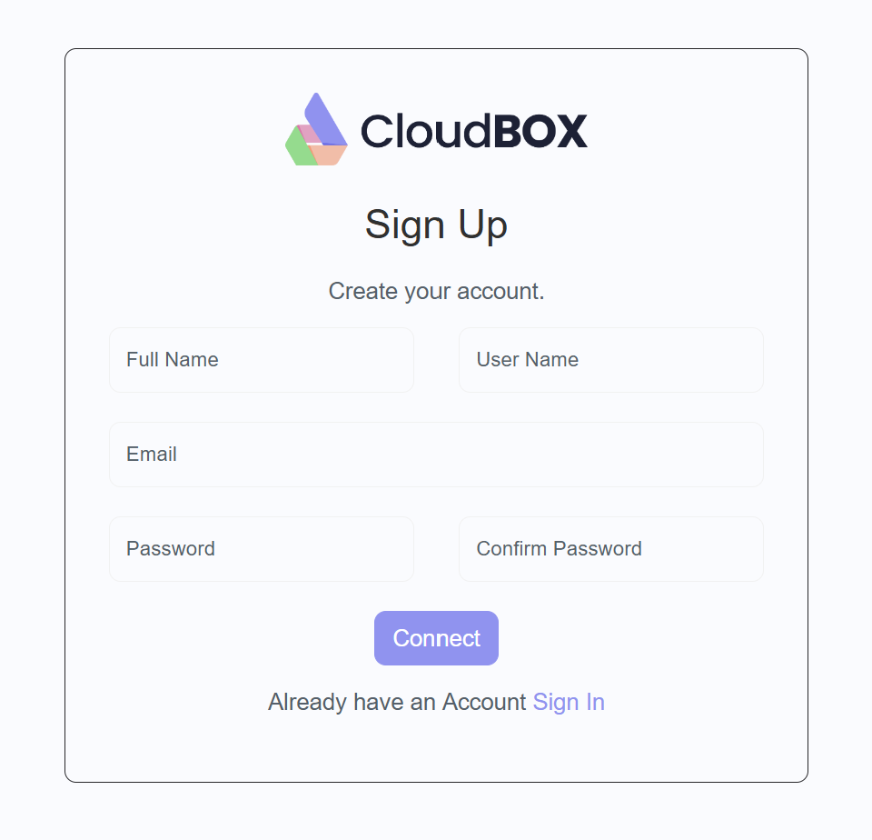

# **CloudBox - Secure Digital Assets License Certificate & Storage Blockchain Dapp**

**CloudBox** is a revolutionary blockchain decentralized application (Dapp) designed to securely manage digital assets licenses and provide robust storage solutions. With the proliferation of digital content and the importance of intellectual property rights, CryptoRights offers an innovative platform for creators, licensors, and licensees to interact with confidence and transparency.

## **📚 Table of Contents**

- [**🚀 Live Deployments**](#live-deployments)
- [**✨ Features**](#features)
- [**⚙️ Technologies**](#technologies)
- [**🖼️ User Interface**](#user-interface)
- [**🛠️ Getting Started**](#getting-started)
- [**👨‍💻 Author**](#author)

<h2 id="live-deployments">🚀 Live Deployments</h2>

We have deployed the entire app on **Vercel** and **Remix**. You can access the live app **[here](https://cloud-box-six.vercel.app/)**.

- **Frontend**: Deployed on **Vercel**. Access the live frontend **[here](https://cloud-box-six.vercel.app/)**.
  - **Smart Contract**: Deployed on **Remix-IDE**. Check out Remix here **[here](https://remix-project.org/)**.

<h2 id="features">✨ Features</h2>

**CloudBox** offers a wide range of features to help users store and procure digital media, like images, PDFs, videos and documents.

- **Decentralised file storage**: Complete on-chain storing of files using IPFS.
- **Multi-file support and marketplace**: Multiple types of file supported and dignified marketplace section to view your/others' documents.
- **Access control options**: Upload files with visibility as false, so as not to show in the marketplace.
- **Crypto-enabled transactions**: Trade in crypto to acquire the asset as yours.
- **Digital certificate generation**: Generate copyright e-certificate with owner's MetaMask private key as a signature.
- **Secure on-chain user registration and login**: User authentication enabled via smart contract enabled through MetaMask
- **Obtain credits through purchases**: Credits based transactions
- **Mutiple network connections**: Connect your account with multiple crypto based networks like Sepolia, Mainnet, Solana etc.

<h2 id="technologies">⚙️ Technologies</h2>

- **Frontend**:
  - **React**: Frontend UI framework.
  - **Next.js**: React-based framework for SSR and routing.
  - **React DOM**: Renders React components to the DOM.
  - **React Router**: Declarative routing for React applications.
  - **React Dropzone**: Drag-and-drop file upload interface.
  - **React Hot Toast**: For toast-style notifications.
- **Web3 / Blockchain**:
  - **ethers.js**: For interacting with Ethereum smart contracts.
  - **web3modal**: Wallet connection modal (MetaMask).
- **Security & Hashing**:
  - **bcryptjs**: Hashing passwords or sensitive data (possibly for user accounts or license secrets).
- **HTTP & APIs**:
  - **axios**: For making HTTP requests to backend services or IPFS APIs.
- **Document Handling**:
  - **html2canvas**: Convert HTML to images (e.g., snapshots of licenses).
  - **jspdf**: Generate PDF files (e.g., downloadable license certificates).

<h2 id="user-interface">🖼️ User Interface</h2>

**CloudBox** features a clean and intuitive user interface designed to provide a seamless experience for users. The app supports both light and dark themes, responsive design, and easy navigation. Here are some screenshots of the app:

### **Dashboard**

<p align="center">
  
</p>

### **Dashboard - Dark Mode**

<p align="center">
  
</p>

### **File Upload Page**

<p align="center">
  
</p>

### **File Upload Page - Dark Mode**

<p align="center">
  
</p>

### **MarketPlace**

<p align="center">
  
</p>

### **Certificate**

<p align="center">
  
</p>

### **Login Page**

<p align="center">
  
</p>

### **Registration Page**

<p align="center">
  
</p>

<h2 id="getting-started">🛠️ Getting Started</h2>

### **Project Installation**

1. **Clone the repository**:

   ```bash
   git clone https://github.com/cicada3298/CloudBox.git
   ```

2. **Install dependencies**:

   ```bash
   npm install
   ```

   Or `npm install --legacy-peer-deps` if you face any peer dependency issues.

3. **Start the Frontend Next app**:
   ```bash
   npm run dev
   ```
4. **Build the Frontend Next app (for production)**:

   ```bash
   npm run build
   ```

5. **The app's frontend will run on `http://localhost:3000`**. You can now access it in your browser.

6. **Create a .env file in root directory**

7. **Replace the env variables with your own values**:

    NEXT_PUBLIC_PINATA_API_KEY=
    NEXT_PUBLIC_PINATA_SECRET=
    NEXT_PUBLIC_FILE_SHARING_ADDRESS=

8. **Deploy the smart contract on Remix-IDE to get the file sharing address**:
    
    <a href="https://remix.ethereum.org/#lang=en&optimize=false&runs=200&evmVersion=null&version=soljson-v0.8.30+commit.73712a01.js">Remix IDE</a>

<h2 id="author">👨‍💻 Author</h2>

Here are some information about me:

- **[Vaibhav Chaudhary](https://github.com/cicada3298)** - An aspiring Software Developer
- Feel free to connect with me on **[LinkedIn](https://www.linkedin.com/in/vaibhavchaudhary898/)**.

---

**Happy Coding and Analyzing! 🚀**

---

[🔝 Back to Top](#DocTalk---ai-powered-document-analysis-and-summarization-app)

